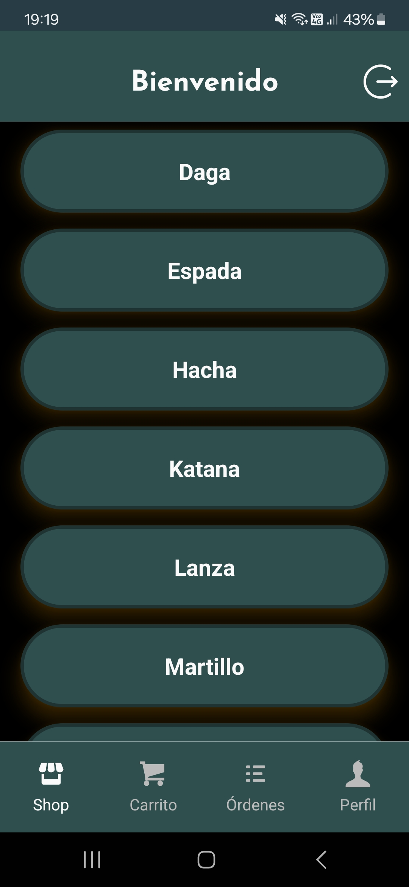

# E-Commerce App - React Native

Una aplicación de comercio electrónico desarrollada con React Native, diseñada para ofrecer una experiencia de compra móvil fluida, intuitiva y segura. Los usuarios pueden explorar productos, agregar una imagen a sus cuentas, realizar compras y ver el historial de órdenes con integración completa de Firebase para autenticación y almacenamiento en la nube.

## Funcionalidades Principales

### Pantalla de Cuenta

- **Acceso seguro:** Solo los usuarios autenticados pueden acceder a la pantalla de perfil y realizar compras, incluye pantallas de registro y login.
- **Información del usuario:** Permite seleccionar la imagen del usuario.


### Autenticación con Firebase

- Utiliza el sistema de autenticación de Firebase para gestionar el acceso de usuarios.
- Permite a los usuarios iniciar sesión y registrarse de manera segura.

### Pantalla de Categorías

- Muestra una selección de categorías en tarjetas.
- Al hacer clic en una categoría, se navega a la pantalla de productos correspondiente.



### Pantalla de Productos

- Lista todos los productos en tarjetas con nombre y foto.
- Incluye un buscador para filtrar productos por nombre.
- Al hacer clic en un producto, se navega a la pantalla de detalles del producto.


### Pantalla de Detalles del Producto

- Proporciona una descripción detallada del producto.
- Muestra el precio, características, una descripción y la imagen del producto.
- Permite agregar el producto al carrito indicando la cantidad.
- Se puede seleccionar la imagen del producto para visualizarla con mayor resolución.


### Pantalla de Carrito

- Lista todos los productos agregados al carrito.
- Muestra el precio, la cantidad, los subtotales y el total.
- Permite modificar la cantidad, eliminar productos, vaciar el carrito o realizar la compra.


### Pantalla de Órdenes

- Lista todas las órdenes de compra realizadas indicando fecha y total de compra.
- Al hacer clic en una orden, se navega a la pantalla de detalles de la orden.


### Pantalla de Detalles del Producto

- Proporciona una descripción detallada de la orden de compra.
- Muestra el nombre del producto, la imagen, el precio unitario, la cantidad comprada, el subtotal por producto y el total general.


### Navegación Inferior

```javascript
const TabNavigator = () => {
  return (
    <Tab.Navigator
      screenOptions={{
        headerShown: false,
        tabBarShowLabel: false,
        tabBarStyle: styles.tabBar,
      }}
    >
      <Tab.Screen
        name="HomeStack"
        component={ShopStack}
        options={{
          tabBarIcon: ({ focused }) => {
            return <TabBarIcon focused={focused} text="Shop" icon="shop" />;
          },
        }}
      />
      <Tab.Screen
        name="CartStack"
        component={CartStack}
        options={{
          tabBarIcon: ({ focused }) => {
            return (
              <TabBarIcon
                focused={focused}
                text="Carrito"
                icon="shopping-cart"
              />
            );
          },
        }}
      />
      <Tab.Screen
        name="OrdersStack"
        component={OrdersStack}
        options={{
          tabBarIcon: ({ focused }) => {
            return;
            <TabBarIcon focused={focused} text="Órdenes" icon="list" />;
          },
        }}
      />
      <Tab.Screen
        name="ProfileStack"
        component={ProfileStack}
        options={{
          tabBarIcon: ({ focused }) => {
            return <TabBarIcon focused={focused} text="Perfil" icon="user" />;
          },
        }}
      />
    </Tab.Navigator>
  );
};
```

- **Pestaña 1 - Shop:** Categorías y productos (stack principal).
- **Pestaña 2 - Carrito:** Detalles del carrito de compras con resumen y botón para finalizar la orden.
- **Pestaña 3 - Órdenes:** Historial de órdenes realizadas.
- **Pestaña 4 - Perfil:** Pantalla del usuario con carga de imagen de perfil.

## Tecnologías Utilizadas

- **React:** Permite la construcción de interfaces de usuario basadas en componentes.
- **React Native:** Permite desarrollar la aplicación móvil nativa usando JavaScript y React.
- **Expo:** Conjunto de herramientas y servicios para simplificar el desarrollo de aplicaciones React Native, entre las que destacan:
  - **Expo Font:** Permite cargar y utilizar fuentes personalizadas en la aplicación.
  - **Expo Picker Image:** Permite que los usuarios suban imágenes de perfil o actualicen sus fotos.
  - **Expo SQLite:** Permite almacenar y gestionar datos localmente utilizando una base de datos SQLite.
  - **Expo Status Bar:** Personaliza la barra de estado del sistema para integrarla con el estilo de la aplicación.
- **Firebase Authentication:** Implementa el sistema de autenticación de Firebase para gestionar la seguridad de la aplicación en su sistema de login y registro.
- **React Native Navigation (Stack y Bottom Tabs):** Gestiona la navegación entre pantallas y pestañas de manera fluida e intuitiva mediante su apilamiento (stack).
- **React Native Paper:** Proporciona componentes de UI basados en Material Design, como el TextInput con ícono incluido.
- **Redux:** Configura y gestiona el estado global de la aplicación de manera simplificada y eficiente, con menos código "boilerplate".
- **RTK Query y Firebase:** Realiza operaciones de lectura/escritura en la base de datos, mejorando la gestión de los mismos.
- **Yup:** Realiza la validación de esquemas de datos, empleada para las direcciones de correo y las contraseñas.

## Instalación

1. Clona el repositorio: `git clone https://github.com/jef13121988/PF-DesarrolloAplicaciones.git`
2. Instala las dependencias: `npm install`
3. Configura las claves de API para servicios externos (Firebase).
4. Configura las credenciales de Firebase en tu proyecto.
5. Ejecuta la aplicación: `npm start`

## Contacto

Para preguntas o soporte, contacta a jony@labs.com.
